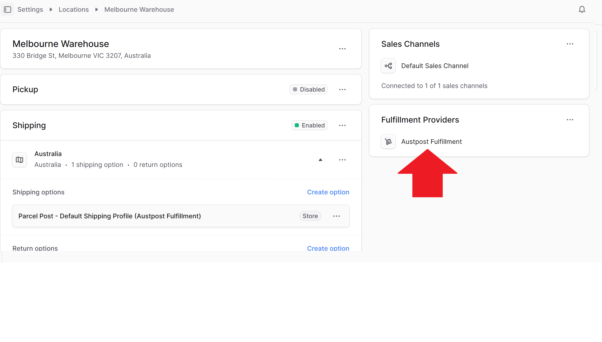
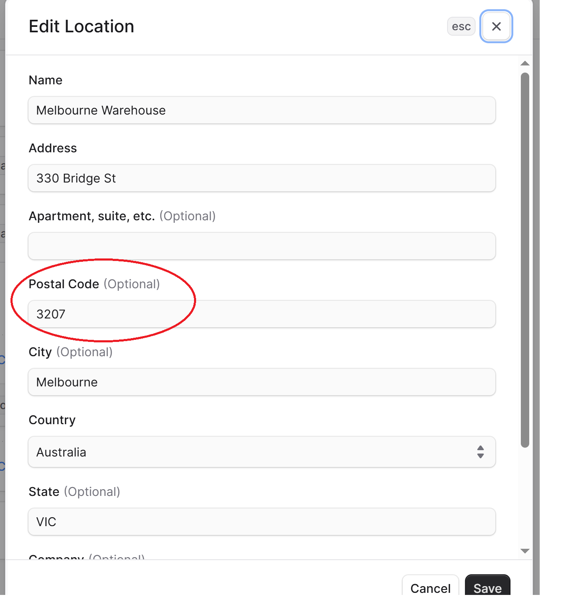
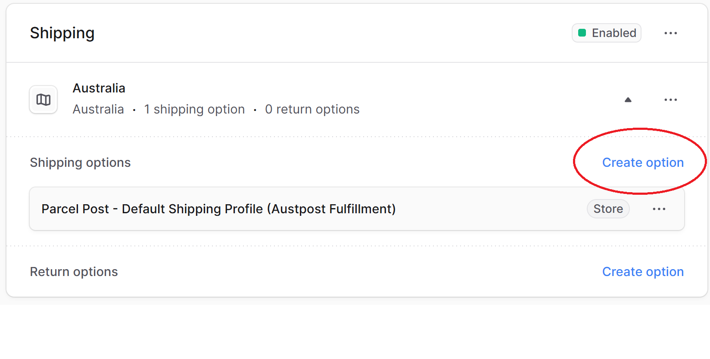
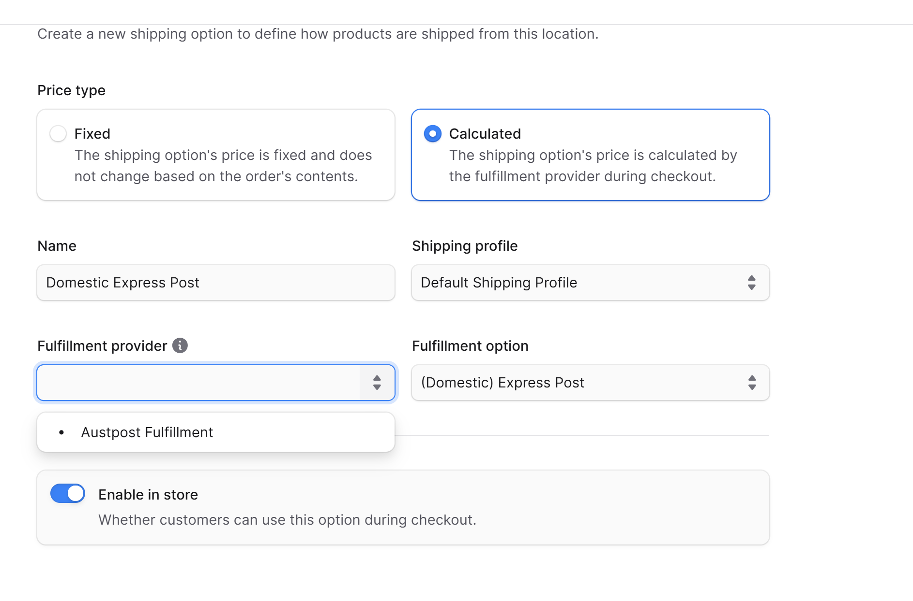
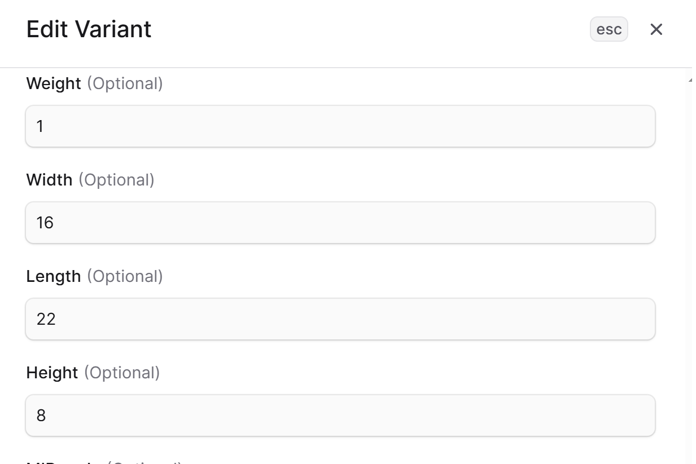

## MedusaJS x Australia Post

Fullfillment module for MedusaJS. This module displays the cost of delivery on checkout. 

# Setup

Get your API key from [Auspost](https://developers.auspost.com.au/apis). Add them to environment variable named `AUSTPOST_API_KEY`. 

# Admin Dashboard Setup

This was used as a reference: https://docs.medusajs.com/user-guide/settings/locations-and-shipping/locations

1. Enable "Austpost Fulfillment" as your fulfillment provider

2. Go into edit location for your location. Ensure postal code is filled in. 

3. Create the shipping options that will be shown to your users on checkout. 

4. Enter the following fields to enable the fulfillment that you support

Price type: Calculated
Name: Domestic Express Post(or whatever name you would like it to be to be shown to users)
Shipping profile: <Your shipping profile>
Fulfillment provider: Austpost Fulfillment
Fulfillment option: <Your choosen option>(Express / Parcel Post)

Repeat step 4 to add more fulfillment options for users. 

5. In product details page, add your products width, length, weight and height. The width, length and height needs to be in CM. Weight needs to be in KG. (Reference: https://developers.auspost.com.au/apis/pac/reference/postage-parcel-domestic-calculate)

Do this for all variants. 

